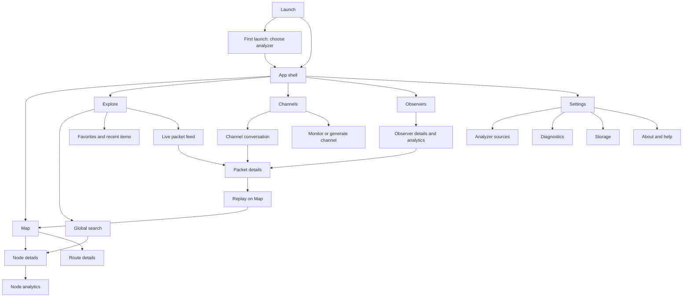

# Native Android experience

Proposal, 2026-09-21. Preserve iOS workflows and information; express them with
Kotlin/Compose and Material 3. Google Play devices are sufficient (user decision).

## Navigation and screen map

The diagram emphasizes primary routes. Global search, favorites, recents and
incoming links can also open channels, observers, nodes and packets directly.

- Phone: Material navigation bar with Map, Explore, Channels, Observers, Settings.
- Expanded window: navigation rail; list/detail or map/detail panes where useful.
- First completed launch starts on Map; restore the last destination thereafter.
- Each destination retains its navigation and scroll state. Reselecting the
  current destination returns to its root; do not erase unrelated filters.
- Back dismisses keyboard/overlay first, then the current detail, then exits from
  a root destination. Use standard Android predictive-back behavior where supported.
- A deep link waits for onboarding if necessary, then opens its destination.
  Current links use the active analyzer because the format has no source field.
  Show that source and provide recovery when an entity cannot be found.

Android's adaptive navigation supports switching navigation patterns for larger
windows; use window size, not a hardcoded tablet detection rule.
[Android navigation guidance](https://developer.android.com/develop/ui/compose/components/navigation-rail)

## Screens and controls

| Area | Phone layout | Expanded layout | Primary native controls |
|---|---|---|---|
| Onboarding | Short explanation, source choice, connection feedback, continue | Centered readable form | Radio/list selection, text field, filled button |
| Map | Map fills content above bottom bar; region/filter/search controls; compact node/route peek | Map with persistent supporting detail pane | Search bar, filter chips, map controls, modal/standard bottom sheet |
| Explore | Dashboard metric grid, favorites by type, recent items, live-feed entry | Wider grid plus supporting detail | Cards, search, overflow menus, explicit reorder controls |
| Node details | Full screen from search/list; map peek expands to full details | Detail pane with analytics destination | Top app bar, favorite toggle, copy/share overflow, section cards |
| Live packets | Readable scrolling list, region/type filters and connection state | List/detail split | Chips, lazy list, explicit new-items affordance when user is scrolled away |
| Packet/route details | Scrollable sections; replay opens Map | Supporting pane where space permits | Selectable text, action buttons, expandable fields |
| Channels | Search/filter/list; Add Channel action | Conversation alongside list | Filter sheet, FAB, message list; no send composer |
| Add channel | Modes for hashtag, private key, generate; validation and label | Constrained dialog or detail form | Segmented controls, text fields, explicit copy action for generated key |
| Observers | Searchable/filterable telemetry list | Observer list and details | Chips, sort menu, native list rows |
| Analytics | Summary, range selection, charts and ranked lists | Two-column arrangement where readable | Range chips, accessible charts, export overflow |
| Settings | Grouped appearance/source/connection/storage/about rows | Settings list and detail | Radio controls, switches only for booleans, dialogs for cache clear |

## Visual alignment — 2026-09-22

The Android map follows the iOS placement: Live Map/status, refresh/search/style
in the toolbar, region and filters at top left, and compact node count/zoom near
the bottom. The packet feed is only entered from Explore; route animation remains
on the map. Explore follows the iOS dashboard → saved items → recently viewed
hierarchy, with search/add in native sheets. Saved-node snapshots and recent nodes
persist per analyzer. Android Material controls and navigation remain native.
Channel/observer favorites, cross-entity search, dashboard customization and full
detail/analytics parity remain outstanding.

## Visual language

- Retain app name/icon and role meanings: repeater orange, room blue, companion
  green, sensor purple. Adjust tonal values for contrast in both themes.
- Branded Material color scheme is the default proposal. Explicit system/light/dark
  selection is required. Optional wallpaper-based dynamic color is a later choice;
  it must not redefine packet/role/status semantics.
- Use Material typography, elevation, shapes, ripple feedback, icons and spacing.
- Use standard app bars and Android sheets; no custom floating glass tab dock.
- Use locale-aware time/number formatting. Preserve explicit UTC labeling on the
  activity heatmap and domain units such as dB, dBm and distance.
- Provide copy/share through platform clipboard and share sheet. Export files
  through scoped content URIs or the system document picker, without broad storage permission.
- No essential action may depend only on swipe or long press. Give reorder,
  remove, copy, share and filter actions visible/menu alternatives.

## State design

Every data screen needs first-load, populated, empty, filtered-empty, refreshing,
cached/stale, partial/unavailable, and failure-with-retry states as applicable.
A missing optional capability is different from a connection failure. Cached
content remains readable during refresh failure with its last-update time shown.

Source switching immediately changes the visible source context. Old-source
responses or socket events cannot repopulate the new source's screen. Region
selection resets when incompatible. Favorites and recents remain associated with
the analyzer where they were saved.

The live feed must not force-scroll while someone reads older entries. Show new
activity and let them return to the newest item. Keep Live and packet Replay
visually distinct. Backgrounding suspends expensive map animation and live work;
foregrounding reconnects and reconciles a fresh snapshot.

Request location only after the user taps Locate. Denial, approximate location,
and disabled location services must leave map browsing fully functional. No
background location collection is planned.

## Accessibility and adaptive acceptance

- TalkBack announces role, name, status, selection and actions; charts have useful
  text summaries and accessible underlying values.
- Large font/display scaling preserves controls and avoids clipped metrics.
- Touch targets meet Android guidance; status is conveyed by text/icon as well as color.
- Respect reduced/disabled system animation; provide static route information.
- Rotation, multi-window resizing and process recreation retain appropriate state.
- Foldable hinge space cannot cover critical controls; expanded layouts avoid
  stretched phone cards and preserve meaningful reading order.
- Validate gesture navigation and three-button navigation, keyboard/IME insets,
  landscape, TalkBack and external keyboard focus.

## Layout review before production screens

Create reviewable phone and expanded-window layouts for: Map with selected node,
Explore, channel conversation, packet details/replay, analytics, and source
switching/error states. Validate navigation with representative iOS workflows.
These are deliverables for Phase 0; this document is the screen specification,
not a claim that visual mockups or usability tests are already complete.
